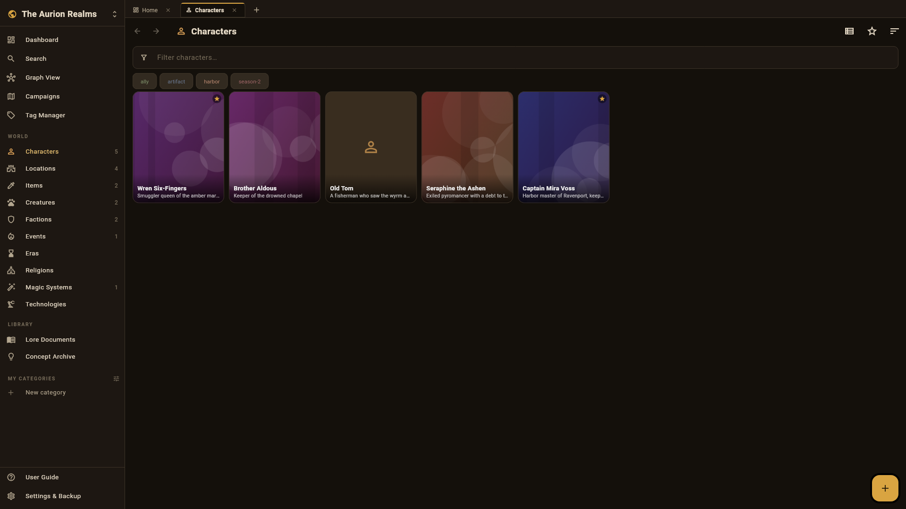
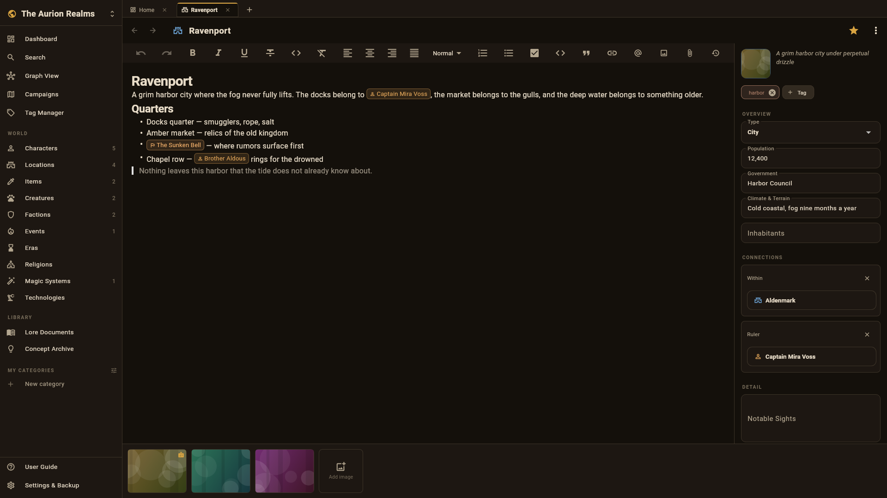

# GMH — Game Master's Hub

An **offline worldbuilding and campaign-management workspace** for tabletop
game masters. Characters, locations, items, creatures, factions, quests and
lore — cross-linked into one navigable web with a relationship graph,
campaign dashboards, a rich-text editor and instant full-text search.
Everything is stored locally on your device: no account, no cloud.



## Download

Windows x64 builds (installer + portable ZIP) are published on the
[Releases page](../../releases). The codebase is a single Flutter project
and also builds for macOS and Linux from source.

## Highlights

- **Worlds with styles** — each world picks its look and vocabulary:
  classic Fantasy or neon Cyberpunk (Runners, Sectors, Gigs).
- **Unified entity system** — characters, locations, items, creatures,
  factions, events, eras, religions, magic systems, technologies and lore
  documents, all template-driven.
- **D&D-style stat cards** — spell cards (level, school, casting time,
  range, components, duration…), full monster stat blocks with the
  six-ability grid and derived modifiers, item cards with rarity, weight,
  value and charges.
- **Rich lore editor** — images, attachments, version history, and inline
  `@` mentions that become two-way links.
- **Character profiles** — tabbed sheets: statistics, biography,
  relationships, inventory, abilities, timeline.
- **Campaign manager** — quest boards grouped by status and session logs
  per campaign.
- **Relationship graph** — a force-directed map of the whole world or any
  entry's local neighborhood.
- **Instant search** — SQLite FTS5 across names, lore, and tags; built to
  stay fast past 10,000 entries.
- **Custom sections** — build your own sections (Guilds, Spells, Recipes…)
  with the Section Constructor: pick modules, define fields, drag to
  reorder.
- **Backups & portability** — automatic daily backups, one-file `.gmhw`
  archives (database + media), JSON export and a printable PDF world book.
- **Five languages** — English, Russian, German, French and Chinese,
  including localized D&D terminology.
- **Built-in user guide** — the `?` icon opens an illustrated manual with
  real screenshots.



## Building from source

```sh
flutter pub get
flutter run          # pick your device
```

Checks:

```sh
flutter analyze
flutter test
```

## Architecture

Clean Architecture in three layers (details in
[`docs/TECHNICAL_DESIGN.md`](docs/TECHNICAL_DESIGN.md) and
[`docs/DATABASE_SCHEMA.md`](docs/DATABASE_SCHEMA.md)):

```
presentation  lib/features/*   Flutter widgets + Riverpod controllers
domain        lib/domain/*     pure-Dart models, contracts, services
data          lib/data/*       drift/SQLite, FTS5, media vault, backup
```

User data lives under the app documents directory: `gmh/gmh.db` (SQLite),
`gmh/worlds/<id>/media/` (content-addressed vault), `gmh/backups/`.
